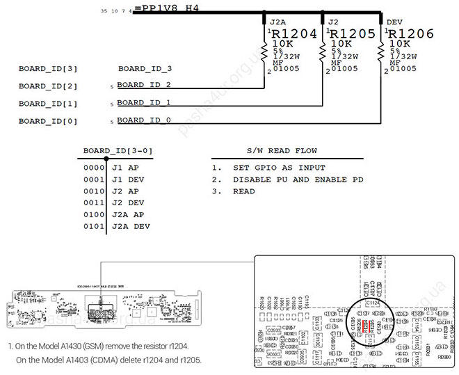
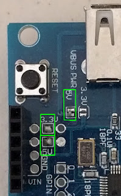
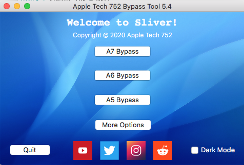
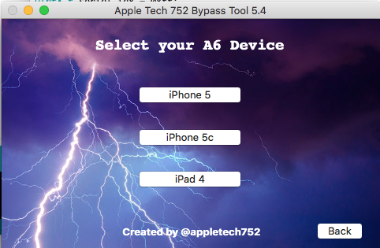
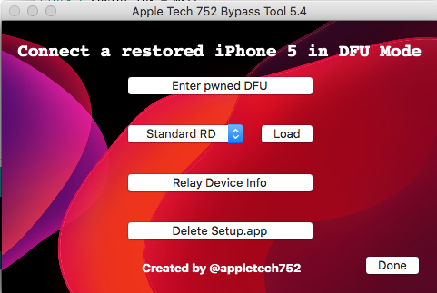
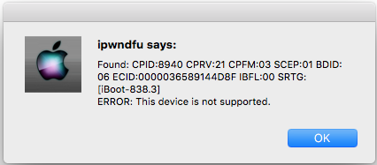
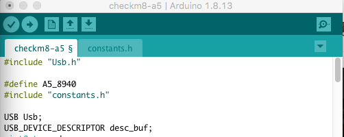
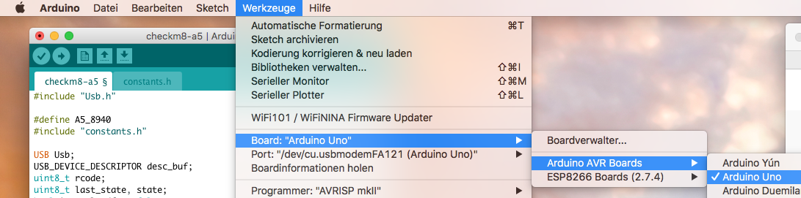

# ipad2_ipad3_icloud_bypass_unlock
How To Remove bypass iCloud Activation Lock for iPad Mini1, iPad2, iPad3, iPhone4s and iPod Touch5 with iOS 9.x.x

# Method #1 Hardwareunlock (only for 4G Devices)
!!! Caution: Cellular Module/GPS dont work after this !!!!

This Method deactivate Cellular Module, so serial number of the iPad changes and iCloud Activation Lock is registred on the "old" serial number. So iPad has no iCloud Activation Lock with "new" serial number.
 ## Parts
 1) Disassemble Tools
 2) screwdriver
 3) solderin iron

## Steps
1) Disassemble the mainboard od the iPad https://de.ifixit.com/Anleitung/iPad+3+Wi-Fi+Logic+Board+austauschen/11603
2) Remove Resistor R1024

3) Re-Assemble iPad
4) Download iPad WiFi Firmware (For iPad2 https://ipsw.me/iPad2,1) (For iPad3 https://ipsw.me/iPad3,1)
5) Recover the iPad with the downloaded iPad WiFi Firmware via iTunes

# Method #2 Softwareunlock(for Wifi-Model and Wifi/4G Model)
!!! Cellular Module/GPS work after this !!!
!!! iTunes sync need workaround COMMING SOON !!!!

Bypass via Arduino + USB Host Shield which is mainly the Tutorial from Apple Tech 752
Apple Tech 752 (https://www.youtube.com/watch?v=oMuprT7YCFo&t=11s)

## Parts 
1) Buy Arduino Uno LINK
2) Buy USBHost Shield for Arduino LINK
3) LED and 220Ohm Resitor (for Bypass Status)

## Prequisites
1) Check if these Pads are solderd on the USBHost-Shield, if not solder them: 

2) Download Arduino IDE
3) Install USBHost Library
4) Patch USB Library by open new Terminal and type: (replace /path/to/Arduino with your directory part)
> cd path/to/Arduino/libraries

> git clone https://github.com/felis/USB_Host_Shield_2.0

> cd USB_Host_Shield_2.0

> git checkout cd87628af4a693eeafe1bf04486cf86ba01d29b8

> git apply path/to/usb_host_library.patch

4) Download Arduino Project https://github.com/synackuk/checkm8-a5
5) Rename Project to "checkm8-a5" and open it in Arduino IDE
6) Download Sliver 5.4 https://www.appletech752.com/Downloads/SliverV5.4.dmg
7) Move Sliver to Application Folder (Sliver must be in your Applications folder in Finder! Sliver only supports MacOS High Sierra and Higher!)
8) Left click on Sliver and select 'show package contents'. Type 'sudo chmod -R 755' in a new terminal window, then click the space bar, then drag and drop the resources folder into Terminal. Click enter.

## Get iPad ready
10) Open Sliver
11) Connect iPad via USB
12) Enter DFU Mode on iPad (Turn iPad off, press Power-Button and Home-Button for 10s, then release Power-Button and keep Home-Button pressed, then wait until iTunes detect iPad in Recovery Mode(iTunes))
13) Check CPID-Number via Sliver "A6 Bypass" > "iPhone 5" > "Enter pwned DFU" > Note The CPID-Number, mine is 8940

  

15) Download Arduino Project https://github.com/synackuk/checkm8-a5

## Get Arduino ready 
16) Rename Project to "checkm8-a5" and open it in Arduino IDE
17) Change the CPID Number in the Arduino project to cour noted CPID-Number

19) Connect Aruduino via USB to Computer (USB A cable) (Greed LED on Arduino should be on)
20) Select USB Port in Arduino IDE

21) Upload sketch to Arduino Uno
22) Unplug Arduino from Computer
23) Plug USBHost-Shield onto Arduino
24) Connect LED and Resitor to USBShield SCHALTPLAN

## Bypass iPad
24) Connect iPad to USBHost-Shield via USB
25) Connect Arduino Uno to Computer via USB
26) 3 LED blinks indicate start of flashing process
27) LED is permanemt on indicates that iPad is now in pwnedDFU-mode
28) Connect your iPad to the Computer and open Sliver

30) Go to "A5 Bypass" > choose your model > click on "Load"
31) If it fails reboot your iPad to pwnedDFU-mode again and try to change "Standart RD" to "Alternate RD" 
32) Follow Sliver instrustions
33) Click "Relay Device Info"
34) Click "Delete Setup.app" and follow Sliver instructions

## Troubleshooting 
### Error while Uploading Sketch to Arduino
If you get an Error Message like "avrdude: stk500_getsync() attempt 1 of 10: not in sync: resp=0x00" while uploading check the Solder Pads on the USB Host Shield as mentioned above

# Conclusion
I got one iPad3 16GB Cellular and one iPad2 64GB Cellurar both with iCloud Activation Lock.

I tested Method #1 with the iPad3 Cellular and it worked for me. The disadvantage of Method #1 is that the Cellular Module and GPS arent available anymore. So it doesnt accept SIM-Cards anymore. In my case this doesnt matter...

On iPad 2 Cellular is tested Method #2 and it also worked after some troubleshooting. On Method #2 the Cellular Module is still working. Also there is no need to disassemble the iPad and if your USBHost-Shield is produced properly also no soldering work.

If your iPad is Cellular and you dont need SIM-Card and GPS i'd recommend to use Method #1.

If you have an iPad WiFi Model only Method #2 works for you. Method #2 need a workaround to sync via iTunes, this workaround is comming soon.

